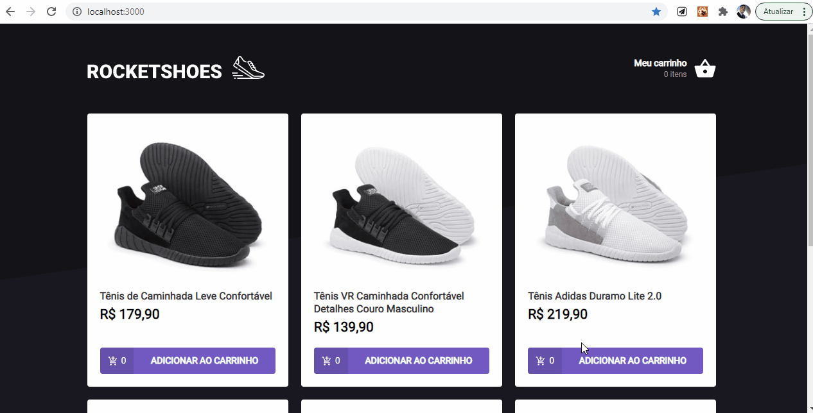

  </img>
  
RocketShots

# Informaçoes:

## Funcionalidades:

- Adiciona novos produto ao carrinho
- Remove os produtos do carrinho
- Altera a quantidade de produtos no carrinho
- Calcula os preços de sub-total e total dos produtos
- Validaçao de estoque
- Exibição de mensagem de erro com o react-toastify
- Preserva dados do carrinho no LocalStorage
- Consome os dados da api fake do JSON sever

## Tecnologias:

- React
- React-toastify
- Typescript
- Styled-components
- Polished
- Axios
- Json-server

## Considerações:

<pre>
  Desafio proposto pela <a href='https://rocketseat.com.br/'>Rocketseat</a> durante o Bootcamp ignite.
  O desafio consistia em faze a implementaçao das funcionalidades de carrinho de compras na aplicaçao.
</pre>
